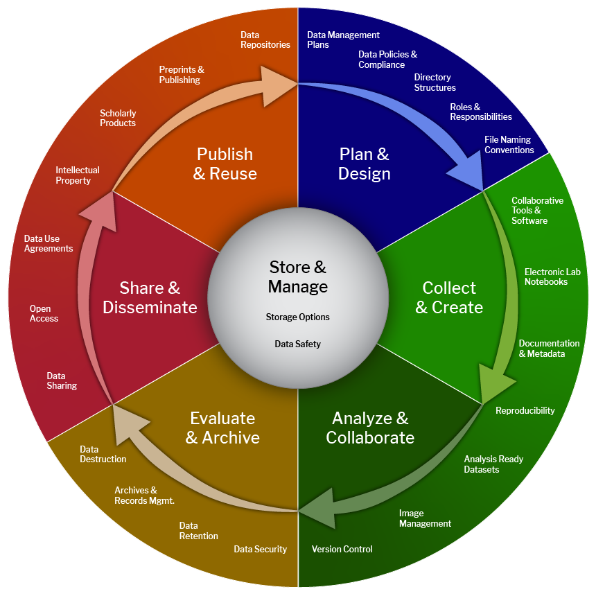

# Situating Yourself in the Research Lifecycle

*Or, how to navigate through data management.*

## Learning Objective

Understand the general research lifecycle and how robust data management practices can mitigate challenges caused by temporal gaps in research projects.

## Key Terms

-   **Research Lifecycle:** The process of conducting research, from inception, through data collection and analysis, to publication. Presented as a lifecycle, as data and publications can be reused by other researchers in the design of additional projects.\
-   **Research Data Management:** The processes, tools, and techniques necessary for collecting, analysing, storing, and publishing data.\
-   **Temporal Gaps**: Periods of time between research activities.

## Lesson

All research projects follow a general lifecycle: from planning and design, through to implementation (which includes data collection and analysis), and concluding with output sharing (including research publishing and data depositing) and reuse, where the cycle begins again, with a new iteration of the same project or the development and launch of a new investigation.

*Cioffi, M., Goldman, J., & Marchese, S. (2023). Harvard Biomedical Research Data Lifecycle (Version 5). Zenodo. <https://doi.org/10.5281/zenodo.8076168>*

While the lifecycle image invokes a tidy overview of how research projects generally progress, the reality is often more complex. For example, a project may require iterations of design and data collection before moving to analysis and publication. This can be compounded by changes in disciplinary research practices and policies at institutional, state, and federal levels.

This messy reality of research projects means that there can be **temporal gaps** in research; in other words, for various reasons, projects may start and stop over time. These temporal gaps can be most acutely felt as personnel join and depart projects. However, you can also observe temporal gaps in your own work, when you may need to shelve projects for weeks or months. Robust data management practices can be invaluable for closing those gaps and easing team members’ transitions in and out of a research project.

In the remainder of this guide, you’ll learn more about different aspects of research data management that will make it easier for you to get acclimated to your lab’s research data, as well as prepare it for your eventual departure from the lab/project (which in turn will make it easier for the next research collaborator!).

## Further Reading

-   [Princeton Data Management Handbook](https://researchdata.princeton.edu/research-lifecycle-guide). This resource was created specifically for researchers at Princeton, but provides a comprehensive view of the research lifecyle.\
-   [Research Data Management Workbook](https://caltechlibrary.github.io/RDMworkbook/). Created for researchers, this workbook is a collection of exercises to help improve data management practices. This is designed for Principal Investigators, but has numerous resources that may be of use to graduate researchers.\

[Get oriented to your data >>>](https://summermengarelli.github.io/temporal-gaps/getting-oriented-to-a-dataset.html)  
