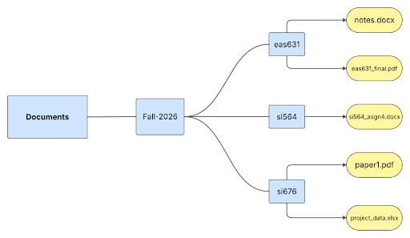

# Navigating and Organizing Files

*Or, how to keep your project materials neatly stored.*

## Lesson Objective

Understand the directory structure on your computer, file naming conventions and how to use them to organize your project files.

## Key Terms

- **Directory:** A folder within a computer’s file system, which might contain other folders (*subdirectories*) and/or files.  
- **Hierarchical Structure:** A structure defined by objects nested within objects, stemming from a single, highest-level “root” object. In the case of a computer’s file system, this refers to the way that files and subdirectories are nested within higher-level directories, up to the root of the system.  
- **Absolute Path:** The path, or address, from the root of a computer’s file system to a directory or file of interest.  
- **Raw Data:** Here, data in the state it is in when you generate/access/receive it.  
- **Relative Path:** The path, or address, to a directory or file of interest, relative to the current working directory.  
- **Working Directory:** The directory within your computer’s file system that you are currently “in;” the directory that a computer program can currently see or access.

## Lesson

Spending a few minutes organizing your research project files is one of the easiest steps you can take to help yourself and potential collaborators in the future. It may be tempting to let files rest where they lie–a desktop or a Google Drive, for example–and simply use your computer or Google’s search bar to find files by their names. Maybe you’ve already taken the extra step of establishing a folder specifically for this project, and you make sure that you save all new or altered project files in that folder. 

This is a good first step, but a few more intentional layers of organization will be hugely beneficial to you, both now and in the future. This lesson will introduce you to your computer’s file system (which you’ve almost certainly traversed, but may not fully understand) and give some brief suggestions for how to organize your project within that system. It also covers file naming conventions: why they’re worth thinking about, and how you might implement them.

### The hierarchy of a computer file system

When you click “Download” on a file you’ve found online, you probably know where to go to find it: your Downloads folder. This is a folder, or **directory** (this lesson will use the terms *folder* and *directory* interchangeably). You may not know that the Downloads folder, as well as the Desktop, Documents, Pictures, and other built-in folders, are contained within another, higher-level directory: your user directory. Your user directory (on an institutional computer, this is probably named after your institutional ID) is inside a Users folder, which is inside your computer’s *root* folder. In this paragraph, we have journeyed backwards from Downloads to the root directory. We can represent this route in a single line, which will look slightly different if your computer is a Mac or Windows machine:

|     **Mac:** /Users/yourname/Downloads  
|     **Windows:** C:\\Users\\yourname\\Downloads        
\

For Mac machines, the first forward slash (**/**) represents the root of the file structure; this is the same as the **C:** in the Windows example. In either case, this is the *path*, or address, to the Downloads folder from the root. 

In addition to saving files in the built-in folders on your computer, you can, of course, make your own folders. For example, you might make a folder called *Fall-2026* inside your Documents folder, with the intention of storing all your coursework for the Fall 2026 semester within. Because it is inside the Documents folder, Fall-2026 is a *subdirectory* of Documents. You could make more subdirectories within Fall-2026, maybe to organize coursework by course. This might look something like this: 

\

Just like we wrote a path to the Downloads folder before, we can construct a path to a given coursework file in this imaginary structure. Let’s say we’re interested in the *project\_data.xlsx* file, which is in the subdirectory for the course *si676*. We’ll write the path assuming that it’s on a Windows machine belonging to the user *kevinq*. Which of the following is the correct path?

|       (A) Users\\kevinq\\Documents\\Fall-2026\\si676\\project_data.xlsx
|       (B) C:\\Users\\kevinq\\Documents\\Fall-2026\\si676\\project_data.xlsx
|       (C) /Users/kevinq/Documents/Fall-2026/si676/project_data.xlsx       
\

If you guessed (B), you are correct! When a path begins all the way at the root directory, like the example above, it’s called the **absolute path** to the file or folder of interest. Imagine that this is like the full list of directions from an origin (e.g. your place of residence) to a destination (e.g. your office or favorite study area on campus). The absolute path shows every nested folder that needs to be navigated to reach the target.

But what if we’re already in the Fall-2026 folder? In our directions analogy, this would be like needing directions to your destination from somewhere on campus: you are already part of the way there, and you only need directions for the final few steps. We need to construct a **relative path**, which gives the directions to our target file (or folder) relative to wherever we currently “are” in the hierarchy. From Fall-2026 to project\_data.xlsx, on a Windows computer, this would look like this:

|     .\\si676\\project\_data.xlsx         
\
In relative paths, the period (**.**) at the beginning represents the current **working directory**, or where you currently “are”–in this case, the Fall-2026 folder.

Now that you have an in-depth understanding of the file system on your computer, let’s cover some recommendations for how to organize your project files within that system.

### A recommended approach to project organization

Given that what files are used and produced during a research project varies widely across projects, labs, and disciplines, the advice here will be broad, and it is up to you to consider how it can be applied to your work. The main thing to remember is that at this moment, while you are managing your research project, *you* are the expert in the data and associated files. This is both a responsibility and an opportunity: regardless of the state of the project when you came aboard, you can leave it better than you found it by adapting these recommendations for your files. 

**Practice 1: Keep project materials together**  
As a first step (and to [get yourself oriented](https://summermengarelli.github.io/temporal-gaps/getting-oriented-to-a-dataset.html)), gather all the “stuff” of your project–raw data files, processed data, documentation, research code, image files, and anything else involved in the work–into one location. This might be a Google Drive or Box folder, or a subfolder you’ve created in your Documents or elsewhere on your computer. (NOTE: This lesson does not give recommendations on backing up files, creating duplicate copies, or storing some aspects of the project on other systems, like pushing your code to GitHub. For more information on storage, please consult the [Keeping Data Safe lesson](https://summermengarelli.github.io/temporal-gaps/keeping-data-safe.html).)

Aside from knowing where everything is, one benefit of starting with all your materials in a single location is that you can easily share the project folder with new collaborators and be assured that they have access to everything they need for onboarding. Additionally, if you work with your materials computationally, regardless of how you further organize the materials within the main project folder, the files will all be fairly near to each other. This lends itself to short and uncomplicated relative paths from one file to another: you can set your working directory to the main project folder and jump around within subdirectories as needed.

**Practice 2: Group files into logical subdirectories**  
From this main folder, we recommend that you subdivide materials by file type and/or by project workflow. This is where the nature of your specific project will dictate how you apply this recommendation: it might make sense to keep all code in a subfolder called *code* or *scripts*, or it might better align with your workflow to store each individual script in the subfolder for its process – one script in a *data-cleaning* folder and another in a *data-visualization* folder, for example. 

It is also worth considering what a “thing” is for your project materials: is there a one-to-one relationship between files and things? For example, does a single image file stand on its own, with one image per research object, or do you have several images of the same object, which need to be treated as a unit? Is the data for a given process a single file, or is your data stored in a complex format that actually requires several different file types? (A common example of this is spatial data. The ESRI shapefile is actually a collection of several geographic and indexing file extensions.) In any case where there is a many-to-one relationship between files and the “thing” that the files comprise, be sure to store all the files for a given research object in their own folder.

It’s generally a good idea to keep **raw data** (where *raw* means whatever state the data is in when you generate/access/receive it) separate from processed/altered versions of that data. Create a new subfolder, in the main project folder or nested within the appropriate subfolder, and have all your data manipulating or processing code output the new data files into that location. It’s crucial that you and any of your current or future collaborators can quickly tell the difference between raw and altered data, so be sure to name the folders where versions of the data are stored in a clear and consistent manner–which leads us to our next best practice.  

**Practice 3: Employ file naming conventions**

The goal of establishing a file naming convention is to avoid the common problem of trying to determine whether “project\_data(2).xlsx” or “project\_data\_final(1).xslx” is the version of the data you need. Conventions–rules that dictate what information should be included in a file name, and how that information should be formatted–ensure that versioning information is clear and that you can tell at a glance what any file in your project contains. What conventions make sense for you will depend closely on the file formats, quantity, and complexity of your project materials, and you may have limited autonomy to rename existing project files. The suggestions below can be adapted as needed, and if you are unable to apply them retroactively to the materials you’ve inherited in your lab, you can still apply them to the materials you produce.

First, if you use any computer programs in your research, we strongly recommend getting into the habit of not including spaces in your folder and file names. Many applications fail to recognize white spaces and will handle your files/folders in unexpected ways–for example, for a file named “Cover Letter.pdf” a program might see “Cover” and “Letter.pdf” as two separate objects. Instead, it’s common to use an underscore (\_) where a white space would normally occur. You can also use dashes (-) or camel casing (writeFileNamesLikeThis). 

From that starting point, imagine your folders and files as moving boxes, and the names you give them as the labels you scrawl on the boxes (“Pots \- Kitchen” or “FRAGILE\!”). What information do you need to include so that your future self or collaborators will know where things are? Taking into account how your computer system will sort files, put the most important information first: if you want to be able to search for files by date, start every file with its creation date. Be sure to format dates uniformly; we recommend the format YYYYMMDD (which follows the international standard [ISO 8601](https://www.iso.org/iso-8601-date-and-time-format.html)). 

Other components of a file or folder name might include abbreviations or full sample IDs, lab location, researcher name, or other important information. If you use abbreviations, be sure to define them in your [README](https://summermengarelli.github.io/temporal-gaps/writing-data-documentation.html). To keep track of versions of the same data end the file name with a standardized versioning annotation, like “\_v03”. Finally, generally avoid special characters, like %\!$@. 

Some resources to help you plan your file naming conventions are linked below, but we want to highlight our favorite, which is Kristin Briney’s [File Naming Convention Worksheet](https://doi.org/10.7907/894q-zr22). Whatever conventions you determine are appropriate for your work, document them\! This will be useful to remind yourself, and it also gives you the opportunity to pass the information on as onboarding material for future members of the lab. 

## Conclusion

Organizing your materials with a logical flow and using clear and consistent naming conventions is a massive first step in improving your project’s data management practices, and these recommendations should not take you more than a working session to implement. Once all your files are in working order, your next steps will be to ensure that the data within those files is standardized and documented as much as possible and that the code in your scripts is well-annotated. Along the way, you can begin to fill out READMEs for your project as a whole and for individual files or processes; these will be slotted into the file organization you established in this lesson and provide a “Start Here\!” place for future collaborators to become oriented to the project.

## Exercises

## Further Readings

- UC Davis DataLab lesson on **navigating the file system** in the command line: [https://ucdavisdatalab.github.io/workshop\_introduction\_to\_the\_command\_line/navigation.html](https://ucdavisdatalab.github.io/workshop_introduction_to_the_command_line/navigation.html)   
- MIT Worksheet: **Naming and Organizing your Files and Folders** by MIT Libraries Data Management Services. Copyright © 2020-04-24 MASSACHUSETTS INSTITUTE OF TECHNOLOGY, licensed under a [Creative Commons Attribution 4.0 International License](https://creativecommons.org/licenses/by/4.0/) except where otherwise noted. Access at https://www.dropbox.com/scl/fi/1zd63iszw33rh4hjcu1dl/Worksheet_fileOrg.docx?rlkey=q0t25t1wttp4qx2p1ne39qfhd&dl=0.
- UC Merced LibGuide on **File and Folder Organization**: [https://library.ucmerced.edu/file-and-folder-organization\#:\~:text=File%20Structures,want%20when%20looking%20up%20files](https://library.ucmerced.edu/file-and-folder-organization#:~:text=File%20Structures,want%20when%20looking%20up%20files)   
- Briney, Kristin A. (2020, June 2)\. **File Naming Convention Worksheet**. California Institute of Technology. [https://doi.org/10.7907/894q-zr22](https://doi.org/10.7907/894q-zr22). 

[Annotate your code >>>](https://summermengarelli.github.io/temporal-gaps/annotating-code.html) 
